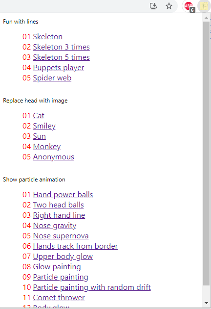

# DEPRECATED Repository
Use [YouTube-Motion-Tracking](https://github.com/deep2universe/YouTube-Motion-Tracking)  


# YouTube pose dream
  
Some examples from this [Video source](https://www.youtube.com/watch?v=eRjUmsB9lMk)    

For more examples and the current progress see [#visualizeYouTube playlist](https://youtube.com/playlist?list=PLl4gbkccaJWkY4CXwfhImgY-AmR9UvWH0)

  
_The logo was designed by a 3 year old girl._

YouTube pose dream is a Chrome AI extension to visualize videos. (Soon also available for Firefox.)  

When you're old enough, you may remember [Winamp](http://www.winamp.com/). There is the possibility to visualize music.   
However, this extension makes similar with videos. The human pose in the video is used as input for the visualization.  
In the process, the existing video is transformed into a psychedelic work of art. But this depends on the video you are watching. 

The goal of this project is for anyone, with or without programming experience, to be able to visualize YouTube.   
In addition, animations should be interchangeable between users.  

Pose estimation is done with [TensorFlow.js](https://www.tensorflow.org/js)  
Particle animation is done with [Proton](https://github.com/drawcall/Proton)  

This project is a [Google Chrome](https://www.google.com/intl/en/chrome/) browser extension. That's why you need this browser to try it out.  

# Table of Contents
1. [How it works](#HowItWorks)
2. [Features](#Features)
   1. [Fun with lines](#showPoseDetection)
      1. [Skeleton](#skeleton)
      2. [Skeleton three times](#skeleton3times)
      3. [Skeleton five times](#skeleton5times)
      4. [Puppets player](#puppetPlayer)
      5. [Spider web](#spiderWeb)
   2. [Replace head with image](#img)
      1. [Cat](#cat)
      2. [Smiley](#smiley)
      3. [Sun](#sun)
      4. [Monkey](#monkey)
      5. [Anonymous](#anonymous)
   3. [Show particle animation](#particle)
      1. [Hand power balls](#handPowerBalls)
      2. [Two head balls](#twoHeadBalls)
      3. [Right hand line](#rightHadnLine)
      4. [Nose gravity](#NoseGravity)
      5. [Nose supernova](#noseSupernova)
      6. [Hands track from border](#handsTrackFromBorder)
      7. [Upper body glow](#upperBodyGlow)
      8. [Glow painting](#glowPainting)
      9. [Particle painting](#particlePainting)
      10. [Particle painting with random drift](#particlePaintingDrift)
      11. [Comet thrower](#cometThrower)
      12. [Body glow](#bodyGlow)
      13. [Burning Man](#burningMan)
3. [Installation](#Installation)
   1. [Download this repository](#clone)
   2. [Open Chrome extensions](#chromeExtension)
   3. [Enable developer mode](#enableDevMode)
   4. [Load extension](#loadExtension)
   5. [Check extension installation](#checkExtension)
   6. [Check Chrome settings](#checkChromeSettings)
   7. [Pin the extension](#pin)
4. [Usage](#Usage) 
5. [Uninstall](#uninstall)
6. [Build](#Build)
7. [Further development](#Further-development)
8. [License](#License)

<a name="Features"></a>
# How it works.
The Chrome extension becomes active, when you watch a YouTube video.  


The extension use MoveNet as model.  
Visual representation of the keypoints:  
  
[Image from tensorflow.js pose-detection model](https://github.com/tensorflow/tfjs-models/tree/master/pose-detection#coco-keypoints-used-in-movenet-and-posenet)  
We use these keypoints to place animations or static content in the video.


<a name="Features"></a>
# Features 

After the installation you can select the following visualizations via the extension menu.  
You can change the visualization while the video is playing.  
  

Or you can change the visualization directly in the video player.  
This also works in full screen mode.   
With the new button the popup can be displayed or disabled.  
  


The video [Fatboy Slim ft. Bootsy Collins - Weapon Of Choice Official 4k Video](https://www.youtube.com/watch?v=wCDIYvFmgW8) was used for all screenshots.


<a name="showPoseDetection"></a>
## Fun with lines

<a name="skeleton"></a>
### Skeleton
This is TensorFlow.js in action.  
[MoveNet](https://blog.tensorflow.org/2021/05/next-generation-pose-detection-with-movenet-and-tensorflowjs.html) is used for the detection.  
Use: `all keypoints`  


<a name="skeleton3times"></a>
### Skeleton 3 times
Use: `all keypoints`  


<a name="skeleton5times"></a>
### Skeleton 5 times
Use: `all keypoints`  


<a name="puppetPlayer"></a>
### Puppets player
Use: `left_wrist, right_wrist, left_shoulder, right_shoulder, left_ankle, right_ankle, nose`  


<a name="spiderWeb"></a>
### Spider web
Use: `all keypoints`  


<a name="img"></a>
## Replace head with image
The eyes are used as a reference for displaying the image.  
All use `left_eye, right_eye`  

<a name="cat"></a>
### Cat


<a name="smiley"></a>
### Smiley


<a name="sun"></a>
### Sun


<a name="monkey"></a>
### Monkey


<a name="anonymous"></a>
### Anonymous


<a name="particle"></a>
## Show particle animation

<a name="handPowerBalls"></a>
### Hand power balls
Every hand gets one energy ball.  
Use: `left_wrist, right_wrist`  


<a name="twoHeadBalls"></a>
### Two head balls
Two energy balls circle around the head.  
Use: `nose`  


<a name="rightHadnLine"></a>
### Right hand line
Only the right hand gets a particle animation.  
Use: `right_wrist`  


<a name="NoseGravity"></a>
### Nose gravity
A gravitational field is created around the nose.  
Use: `nose`  


<a name="noseSupernova"></a>
### Nose supernova
Supernovas are constantly exploding on the nose.  
Use: `nose`  


<a name="handsTrackFromBorder"></a>
### Hands track from border
Use: `left_wrist, right_wrist`  
The yellow ray is connected to the right hand.  
The red ray is connected to the left hand.  
If the hands are too far away from the edge, the connection is interrupted.  


<a name="upperBodyGlow"></a>
### Upper body glow
Use: `left_wrist, right_wrist, left_elbow, right_elbow, left_shoulder, right_shoulder`  


<a name="glowPainting"></a>
### Glow painting
Use: `left_wrist, right_wrist`  


<a name="particlePainting"></a>
### Particle painting
Use: `left_wrist, right_wrist`  


<a name="particlePaintingDrift"></a>
### Particle painting with random drift
Use: `left_wrist, right_wrist`  


<a name="cometThrower"></a>
### Comet thrower
Use: `left_wrist, right_wrist`  


<a name="bodyGlow"></a>
### Body glow
Use: `left_wrist, right_wrist, left_elbow, right_elbow, left_shoulder, right_shoulder, left_ankle, right_ankle, left_hip, right_hip`  


<a name="burningMan"></a>
### Burning Man
Use: `left_wrist, right_wrist, left_elbow, right_elbow, 2*left_shoulder, 2*right_shoulder, 2*left_ankle, 2*right_ankle, left_hip, right_hip, left_ear, right_ear, nose`  


<a name="Installation"></a>
# Installation
<a name="clone"></a>
## Download this repository
```shell
git clone https://github.com/deep2universe/ChromePoseDream.git
```
<a name="chromeExtension"></a>
## Open Chrome extensions
Open this URL
```
chrome://extensions
```
<a name="enableDevMode"></a>
## Enable developer mode
In the upper right corner you have to activate the developer mode.  

<a name="loadExtension"></a>
## Load extension
Click this button to load the extension.  
Then select the ```dist``` Folder from this repository.  


<a name="checkExtension"></a>
## Check extension installation
You should now see the following entry.  


<a name="checkChromeSettings"></a>
## Check Chrome settings
Go to this [URL](chrome://settings/accessibility)
```
chrome://settings/accessibility
```
In the System settings make sure to enable this:    


<a name="pin"></a>
## Pin the extension
In the upper right corner click this to pin the extension.  


<a name="Usage"></a>
# Usage
Open [YouTube](https://www.youtube.com/)

Watch a video and have fun.

<a name="uninstall"></a>
# Uninstall
Just go to the `chrome://extensions` page and disable or delete the extension.  
This will be possible later via the popup/settings page.  

<a name="Build"></a>
# Build
All the code is in the src directory.  
You need [PARCEL](https://parceljs.org/) for the build.
```shell
# install PARCEL
npm install -g parcel-bundler

# install dependencies
npm install

# build dist folder
npm run build
```


<a name="Further-development"></a>
# Further development

The following is still on the TODO list:
- Support for other video platforms (e.g. Vimeo)
- Support for multi-pose detection.
- Internationalization
- Export of the pose detection keypoints for other applications.
- Use pose detection keypoints to feed GAN or VAE model and display result in webpage.
- It should be possible to deactivate the extension. Currently, you must do this in `chrome://extensions`
- Fill settings page with content (default animation, disable extension, language settings etc.)
- Publish to Chrome extension store.
- Clean up code.
- Add support for [three.proton](https://github.com/drawcall/three.proton/) to enable 3D particles.
- Check content.js video event listener, - sometimes you have to reload the page to start pose dream.
- Add more particle animations.
- Create Firefox extension and publish to Firefox Browser ADD-ONS

This is an example of how this project setup could be extended in the future.  
Currently, the focus of the project is on exploring the existing architectural possibilities. 

With the help of artificial intelligence, many other enhancements are feasible. For example, the acoustic content of the video is not viewed and could also be used.

If you want to support, pull requests are always welcome.  
If you find any bugs please report them.

<a name="License"></a>
# License
[Apache License 2.0](LICENSE)


